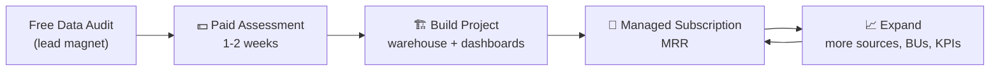
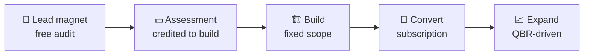
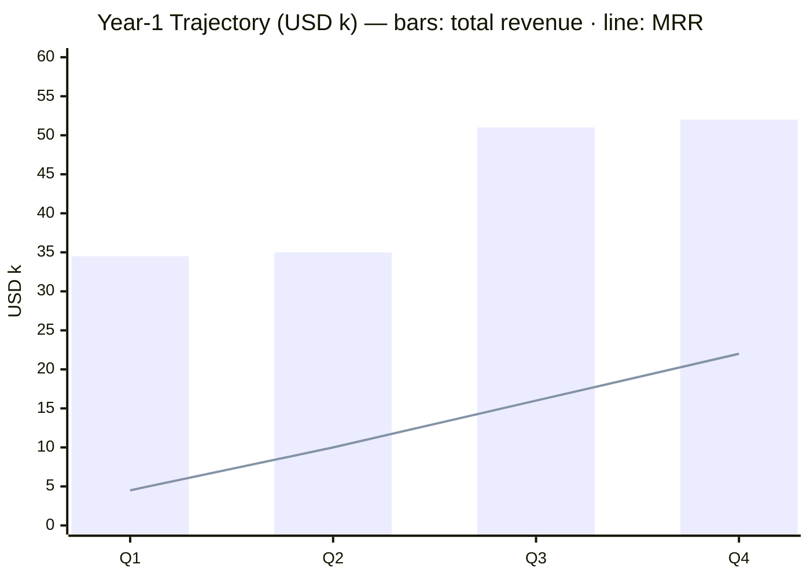

# 💼 BI as a Service (BIaaS)

!!! quote "The Core Idea"
    Don't sell **hours** — sell **outcomes**: trustworthy data, automated reports,
    and decision-ready dashboards, delivered as a subscription.

-   :material-cash-multiple:{ .lg .middle } **Year-1 potential ≈ $142k**

    ---

    $120k project revenue + $22k MRR run-rate, compounding yearly.

-   :material-chart-line:{ .lg .middle } **70–85% gross margin**

    ---

    On recurring revenue — because frameworks are reusable assets.

-   :material-shield-check:{ .lg .middle } **60% head start**

    ---

    Templates, ETL patterns and docs = our moat on every new client.

---

## 1. The Model in One Picture

**Land with an audit, build with a fixed-fee project, keep with MRR, grow with expansion.**

---

## 2. Who Buys — Ideal Customer Profile

-   :material-account-group:{ .lg .middle } **Size**

    ---

    50–500 employees, multi-branch / multi-BU.

-   :material-storefront:{ .lg .middle } **Industries**

    ---

    Logistics, retail, FMCG, distribution, F&B — *our exact domain experience*.

-   :material-database-alert:{ .lg .middle } **Data Reality**

    ---

    Has ERP/POS data but **no BI team**; lives in Excel chaos.

-   :material-alert-circle:{ .lg .middle } **Pain**

    ---

    No single source of truth, month-end blind spots, manual Monday reports.

-   :material-lightning-bolt:{ .lg .middle } **Trigger Event**

    ---

    New CFO · investor reporting · ERP go-live · expansion.

---

## 3. What Is Chargeable — The Billable Menu

### 3.1 One-Time Build Revenue (Projects)

-   :material-magnify:{ .lg .middle } **P-1 · BI Readiness Assessment**

    ---

    Schema audit · data-quality score · anti-pattern report · 90-day roadmap

    **$1,500–3,000** · 1–2 weeks

-   :material-database-cog:{ .lg .middle } **P-2 · Warehouse Design & Build**

    ---

    Star schema + MDM for one business unit

    **$6,000–18,000** · 4–8 weeks

-   :material-sync:{ .lg .middle } **P-3 · ETL Connector** *(per source)*

    ---

    ERP / POS / Sheets / API → warehouse

    **$1,500–5,000** · 1–2 weeks

-   :material-view-dashboard:{ .lg .middle } **P-4 · Dashboard** *(per board)*

    ---

    Executive / ops / finance board

    **$800–2,500** · 1–2 weeks

-   :material-broom:{ .lg .middle } **P-5 · Master Data Cleanup**

    ---

    Golden records · unified SKUs · UOM mapping

    **$2,000–8,000** · 2–4 weeks

-   :material-target:{ .lg .middle } **P-6 · KPI / OKR Workshop**

    ---

    KPI tree · SLA definitions · department targets

    **$1,000–2,500** · 1 week

-   :material-book-open-variant:{ .lg .middle } **P-7 · Governance & Docs Pack**

    ---

    Policies · runbooks · documentation library

    **$1,500–4,000** · 1–2 weeks

### 3.2 Recurring Revenue (MRR)

-   :material-email-send:{ .lg .middle } **R-1 · Managed Report Distribution**

    ---

    Automated weekly/monthly reports, schedules, recipient groups

    **$150–300 / report / month**

-   :material-autorenew:{ .lg .middle } **R-2 · Managed ETL & Refresh**

    ---

    Daily sync · monitoring · failure alerts · fixes

    **$500–2,000 / month**

-   :material-wrench:{ .lg .middle } **R-3 · Dashboard Care Plan**

    ---

    Bug fixes · small changes · version updates

    **$300–1,000 / month**

-   :material-scale-balance:{ .lg .middle } **R-4 · Data Quality & Governance**

    ---

    Match-rate monitoring · weekly DQ review · stewardship

    **$500–1,500 / month**

-   :material-account-tie:{ .lg .middle } **R-5 · Fractional BI Lead**

    ---

    Strategy · roadmap · monthly executive review

    **$2,000–6,000 / month**

-   :material-hand-coin:{ .lg .middle } **R-6 · Support Retainer**

    ---

    Block of hours (10 / 25 / 50)

    **$400–1,800 / month**

### 3.3 Usage & Ad-Hoc

-   :material-timer-sand:{ .lg .middle } **Ad-hoc analysis** — **$60–120 / hour**
-   :material-school:{ .lg .middle } **Training (half-day)** — **$300–600**
-   :material-account-multiple:{ .lg .middle } **Hosted seat** — **$15–40 / user / month**

### 3.4 Value-Based (High-Margin)

-   :material-piggy-bank:{ .lg .middle } **Savings Share**

    ---

    10–20% of **first-year documented savings** (stock reduction, margin fixes), capped.

-   :material-trending-up:{ .lg .middle } **Revenue Uplift Share**

    ---

    % of measurable uplift attributed to pricing / assortment analytics.

---

## 4. Packaging — Three Subscription Tiers

-   :material-rocket-launch:{ .lg .middle } **Starter — $990/mo**

    ---

    Setup $2,500 · 2 sources · 3 dashboards
    Weekly refresh · 3 managed reports
    Email support · 48 h

-   :material-star:{ .lg .middle } **Growth — $2,490/mo** ⭐ *most popular*

    ---

    Setup $6,000 · 5 sources · 8 dashboards
    Daily refresh · 10 managed reports
    Priority support · 24 h · monthly strategy call

-   :material-crown:{ .lg .middle } **Enterprise — $5,900+/mo**

    ---

    Custom setup · unlimited sources · near real-time
    SLA-backed support · 4 h · bi-weekly calls
    Fractional BI lead included

!!! info "Commercial rules"
    Annual prepay = **10–15% discount** · minimum term **6 months** ·
    changes outside scope = **change order (billable)**.

---

## 5. Unit Economics — How the Money Works

-   **70–85%** — gross margin, recurring
-   **45–60%** — gross margin, projects
-   **≥ 60%** — revenue mix as MRR by month 18
-   **< 6 mo** — CAC payback
-   **$50–200** — cloud + tools cost per client / month
-   **< 10%** — logo churn / year (daily reports = sticky)

!!! tip "Why margins are high"
    Our frameworks are **reusable assets** — build once, deploy many.

---

## 6. Sales Motion — Land & Expand

1. **Lead magnet:** free 30-min data audit or a sample dashboard built from *their* data.
2. **Paid assessment (P-1):** fee credited against the build — filters serious buyers.
3. **Build (P-2…P-7):** fixed price, fixed scope, our templates do 60% of the work.
4. **Convert:** at go-live, every client moves onto a subscription tier.
5. **Expand:** quarterly business review → new sources, BUs, KPIs, seats.

---

## 7. Productize What We Already Own

-   :material-email-send:{ .lg .middle } **GAS report-automation framework** → R-1 Managed Report Distribution
-   :material-database-cog:{ .lg .middle } **Chunked SQL ETL library** → P-2/P-3 "Warehouse-in-a-Box"
-   :material-target:{ .lg .middle } **KPI / OKR / SLA framework** → P-6 Workshop + R-4 monitoring
-   :material-book-open-variant:{ .lg .middle } **MkDocs documentation library** → P-7 Governance Pack
-   :material-lifebuoy:{ .lg .middle } **Zammad SLA setup** → Support-Ops Setup offering
-   :material-broom:{ .lg .middle } **Pricelist / master-data SQL** → P-5 MDM Cleanup

> This reuse is our **moat**: competitors start from zero on every client; we start from 60%.

---

## 8. Contracts, SLAs & Guardrails

!!! success "Data ownership"
    Client owns all data & credentials; we operate under **NDA + DPA** — see
    [Glossary](../library/glossary.md).

!!! warning "Scope control"
    "Maintenance" vs "change" is defined in contract; changes = **change orders**.

!!! info "SLA per tier"
    Response/resolution times mirror our [SLA Guidelines](../policies/ticket-sla-guidelines.md) format.

!!! tip "Exit clause = selling point"
    Full handover pack (docs + code). *"You own everything"* wins trust, not risk.

---

## 9. 12-Month Revenue Example (Solo → Small Team)

**Year 1 ≈ $120k projects + $22k MRR run-rate** — compounding as MRR overtakes projects.

---

## 10. Risks & Mitigations

-   :material-alert:{ .lg .middle } **Scope creep**

    ---

    Fixed scope + change orders + assessment phase.

-   :material-database-alert:{ .lg .middle } **Poor client data quality**

    ---

    Assessment sets expectations; DQ exclusions in contract.

-   :material-account-key:{ .lg .middle } **Key-person dependency**

    ---

    Templates + documentation library (our moat).

-   :material-exit-run:{ .lg .middle } **Churn**

    ---

    Embed into daily operations — reports people rely on.

-   :material-credit-card-off:{ .lg .middle } **Payment risk (SMEs)**

    ---

    Annual prepay discount; monthly billing with card-on-file.

---

> [Library Index](../library/index.md) · [Glossary](../library/glossary.md) ·
> [Skills Matrix](../library/skills-matrix.md) · [What We Do](../what-we-do.md)