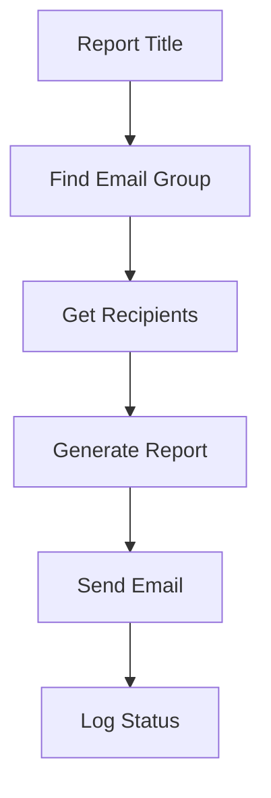
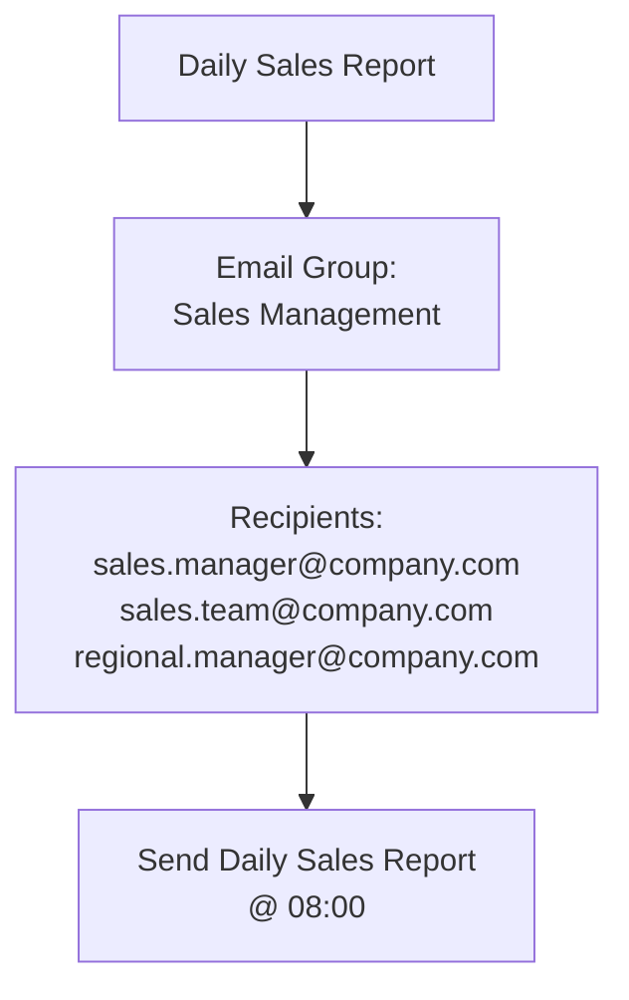
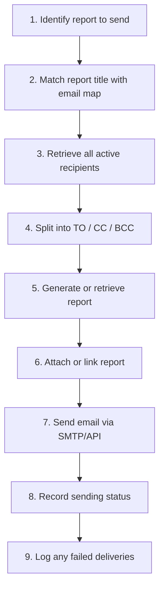

# 📧 Email Distribution & Automation Mapping

!!! quote "Key Principle"
    **Report Title is the primary key** for determining which email group receives the report.
    This allows the automation system to be maintained centrally without hard-coding
    individual email addresses into the automation logic.

## 1. Purpose

This document defines the email recipient groups for automated report distribution.
Recipients are grouped based on the **Report Title** so that each report can be
automatically sent to the appropriate stakeholders — fulfilling Epic 4 task
*[Looker Studio dashboard (SLA ↔ KRs sync)](../projects/epic-4-performance-bi.md)*.

---

## 2. Report Email Groups

| Group ID | Report Title | Email Group | Description |
|---|---|---|---|
| RPT-001 | Daily Sales Report | Sales Management | Daily sales performance |
| RPT-002 | Weekly Sales Performance | Sales Management | Weekly sales summary |
| RPT-003 | Monthly Sales Report | Management | Monthly business performance |
| RPT-004 | Customer Analysis Report | CRM Team | Customer behavior and analysis |
| RPT-005 | Inventory Report | Operations Team | Inventory status and movement |
| RPT-006 | Finance Summary Report | Finance Team | Revenue and financial summary |

---

## 3. Email Recipient Mapping

### RPT-001 — Daily Sales Report

| Field | Value |
|---|---|
| **Email Group** | Sales Management |
| **Schedule** | Daily |
| **Send Time** | 08:00 AM |

**Recipients (TO):**
- sales.manager@company.com
- sales.team@company.com
- regional.manager@company.com

**CC:** bi.team@company.com

---

### RPT-002 — Weekly Sales Performance

| Field | Value |
|---|---|
| **Email Group** | Sales Management |
| **Schedule** | Every Monday |
| **Send Time** | 09:00 AM |

**Recipients (TO):**
- sales.manager@company.com
- regional.manager@company.com

**CC:**
- bi.team@company.com
- management@company.com

---

### RPT-003 — Monthly Sales Report

| Field | Value |
|---|---|
| **Email Group** | Management |
| **Schedule** | Monthly |
| **Send Time** | 10:00 AM |

**Recipients (TO):**
- management@company.com
- finance.manager@company.com
- sales.director@company.com

**CC:** bi.team@company.com

---

## 4. Automation Flow



### Concrete Example



---

## 5. Recommended Data Structure

For the actual automation system, maintain the mapping in a database table or CSV.
This aligns with the warehouse pattern used in [ETL Guide](etl-guide.md) for
dimension tables:

```sql
CREATE TABLE etl_test.dim_report_email_map (
    report_id        INT AUTO_INCREMENT PRIMARY KEY,
    report_title     VARCHAR(255) NOT NULL,
    email_group      VARCHAR(100) NOT NULL,
    recipient_email  VARCHAR(255) NOT NULL,
    recipient_type   ENUM('TO','CC','BCC') NOT NULL DEFAULT 'TO',
    active           TINYINT(1) NOT NULL DEFAULT 1,
    last_updated_at  DATETIME(3) DEFAULT CURRENT_TIMESTAMP(3) ON UPDATE CURRENT_TIMESTAMP(3),
    INDEX idx_report_title (report_title),
    INDEX idx_email_group (email_group)
) ENGINE=InnoDB DEFAULT CHARSET=utf8mb4 COLLATE=utf8mb4_0900_ai_ci;
```

**Sample rows:**

| report_title | email_group | recipient_email | recipient_type | active |
|---|---|---|---|---|
| Daily Sales Report | Sales Management | sales.manager@company.com | TO | Yes |
| Daily Sales Report | Sales Management | sales.team@company.com | TO | Yes |
| Daily Sales Report | Sales Management | regional.manager@company.com | TO | Yes |
| Daily Sales Report | Sales Management | bi.team@company.com | CC | Yes |
| Weekly Sales Performance | Sales Management | sales.manager@company.com | TO | Yes |
| Weekly Sales Performance | Sales Management | regional.manager@company.com | TO | Yes |
| Monthly Sales Report | Management | management@company.com | TO | Yes |
| Monthly Sales Report | Management | finance.manager@company.com | TO | Yes |

---

## 6. Automation Configuration

| Report Title | Frequency | Send Time | Email Group | Status |
|---|---|---|---|---|
| Daily Sales Report | Daily | 08:00 | Sales Management | Active |
| Weekly Sales Performance | Weekly | Monday 09:00 | Sales Management | Active |
| Monthly Sales Report | Monthly | 10:00 | Management | Active |
| Customer Analysis Report | Weekly | Friday 09:00 | CRM Team | Active |
| Inventory Report | Daily | 08:30 | Operations Team | Active |

---

## 7. Naming Convention

```
Report Title
    ↓
Email Group
    ↓
Recipient List
    ↓
Automation Schedule
```

**Example:**

```
Daily Sales Report
→ Sales Management
→ sales.manager@company.com
→ sales.team@company.com
→ Daily at 08:00 AM
```

---

## 8. Future Automation Flow



### Example Log

| Date | Report Title | Email Group | Recipients | Status |
|---|---|---|---|---|
| 2026-08-12 | Daily Sales Report | Sales Management | 3 | ✅ Sent |
| 2026-08-12 | Inventory Report | Operations Team | 4 | ✅ Sent |
| 2026-08-12 | Customer Analysis Report | CRM Team | 3 | ❌ Failed |

!!! warning "Failure Handling"
    Failed deliveries must trigger an alert to `bi.team@company.com` and be retried
    at the next scheduled run. Log rows are retained 90 days for audit.

---

## 9. Integration with Epic 4

This email automation fulfills the **BI Delivery** pillar of Epic 4. Measured
outcomes feed back into the KR dashboard:

| KR | How This Page Delivers It |
|---|---|
| Report delivery SLA | Schedule adherence tracked in `fact_email_log` |
| Stakeholder coverage | Active recipient count per email group |
| Delivery reliability | % successful sends per report |

> [← Back to ETL Guide](etl-guide.md) · [Epic 4](../projects/epic-4-performance-bi.md) · [Daily Routine](../projects/daily-routine.md)