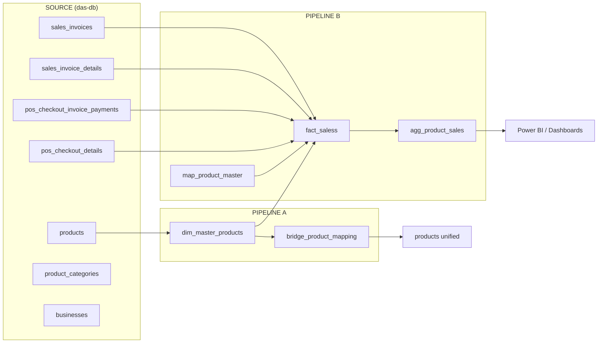

# 📘 Unified Data Warehouse — ETL Guide

!!! info "Quick Info"
    - **Pipeline A:** Master Product Mapping (golden record + bridge)
    - **Pipeline B:** Sales Fact ETL (Invoice + POS → unified fact)
    - **Source:** `das-db` (operational DAS system)
    - **Target:** `etl_test` (analytics warehouse)
    - **Full-load runtime:** ~15–20 minutes

This guide documents the end-to-end ETL that powers the **Unified Data Warehouse Initiative**. For business context (the 5 Business Units, the SKU-mismatch problem, and the star-schema roadmap), see the [Project Overview](../projects/index.md). For raw table definitions, see the [Database Schema Reference](../appendix/database-schema.md).

---

## 1. Architecture Overview



### 1.1 Why This Exists

The DAS system stores each Business Unit's products **independently**, so the same physical product (e.g., *Coca-Cola 330ml*) appears as many different `products.id` rows with inconsistent names/SKUs. This pipeline creates a **golden record** (`dim_master_products`) and a **bridge** so sales from all BUs can be rolled up to a single master product.

---

## 2. Prerequisites

```sql
USE etl_test;
SET sql_safe_updates = 0;
SET SESSION net_read_timeout  = 600;
SET SESSION net_write_timeout = 600;
SET SESSION wait_timeout      = 28800;
SET SESSION max_execution_time = 0;
```

!!! warning "Execution Order"
    **Pipeline A must complete before Pipeline B.** Pipeline B resolves `master_product_id` from tables built in Pipeline A.

---

## 3. Source Tables (`das-db`)

| Table | Role | Key Columns |
|---|---|---|
| `products` | BU-level catalog (fragmented) | `id`, `business_id`, `barcode`, `sku`, `name` |
| `sales_invoices` | B2B invoice header | `id`, `business_id`, `invoice_date`, `current_status` |
| `sales_invoice_details` | B2B line items | `sales_invoice_id`, `product_id`, `detail_qty`, `detail_total_amount`, `cogs` |
| `pos_checkout_invoice_payments` | Retail header | `id`, `business_id`, `checkout_date`, `current_status` |
| `pos_checkout_details` | Retail line items | `pos_checkout_invoice_payment_id`, `product_id`, `detail_qty`, `cogs` |
| `product_categories` | BU category lookup | `id`, `business_id`, `name` |
| `businesses` | BU master | `id`, `name`, `business_group_id` |

!!! tip "Status Filters"
    Invoice: `Confirmed`, `Partial Paid`, `Paid`. POS: `Paid` only. This excludes `Draft`, `Void`, and `Write Off` rows from revenue.

---

## 4. Pipeline A — Master Product Mapping

### 4.1 Matching Strategy

```
Priority 1: barcode  (if present)
Priority 2: sku      (fallback)
```

**Golden record selection** (when duplicates share a key): prefer `is_active=1`, then latest `updated_at`, then latest `created_at`, then highest `id`.

### Steps 01–03 — Stage Raw Products

```sql
CREATE TABLE etl_test.products LIKE `das-db`.products;      -- 01 clone schema
INSERT INTO etl_test.products SELECT * FROM `das-db`.products;  -- 02 load raw
```

### Steps 04–06 — Data Quality Checks (manual)

Run these to quantify fragmentation before cleaning: duplicate barcodes, SKU name mismatches, and junk records (blank barcode **and** sku).

### Steps 07–08 — Build Golden Record (Pass 1)

```sql
CREATE TABLE etl_test.dim_master_products (
    master_product_id BIGINT PRIMARY KEY,
    primary_source_id BIGINT NOT NULL,
    primary_business_id VARCHAR(191),
    master_match_key VARCHAR(255),
    master_barcode VARCHAR(100), master_sku VARCHAR(100),
    master_product_name VARCHAR(255), master_description TEXT,
    brand_name VARCHAR(100), category_id BIGINT, unit_id BIGINT,
    sales_price DECIMAL(20,4), purchase_price DECIMAL(20,4),
    last_updated_at DATETIME(3),
    INDEX idx_master_match_key (master_match_key)
);

INSERT INTO etl_test.dim_master_products
WITH ranked AS (
  SELECT *, COALESCE(NULLIF(TRIM(barcode),''), NULLIF(TRIM(sku),'')) AS match_key,
    ROW_NUMBER() OVER (
      PARTITION BY COALESCE(NULLIF(TRIM(barcode),''), NULLIF(TRIM(sku),''))
      ORDER BY is_active DESC, updated_at DESC, created_at DESC, id DESC
    ) AS rn
  FROM `das-db`.products
  WHERE (barcode IS NOT NULL AND TRIM(barcode)!='')
     OR (sku IS NOT NULL AND TRIM(sku)!='')
)
SELECT DENSE_RANK() OVER (ORDER BY match_key), id, business_id, match_key,
  NULLIF(TRIM(barcode),''), NULLIF(TRIM(sku),''), name, description,
  brand_name, category_id, unit_id, sales_price, purchase_price, updated_at
FROM ranked WHERE rn = 1;
```

### Steps 09–13 — Bridge + Unified Products

```sql
CREATE TABLE etl_test.bridge_product_mapping (
  original_product_id BIGINT NOT NULL, business_id VARCHAR(191) NOT NULL,
  master_product_id BIGINT NOT NULL, mapped_by_strategy VARCHAR(50),
  PRIMARY KEY (original_product_id, business_id),
  INDEX idx_bridge_master (master_product_id)
);

INSERT INTO etl_test.bridge_product_mapping
SELECT p.id, p.business_id, m.master_product_id,
  CASE WHEN NULLIF(TRIM(p.barcode),'')=m.master_barcode THEN 'BARCODE_MATCH'
       WHEN NULLIF(TRIM(p.sku),'')=m.master_sku THEN 'SKU_MATCH'
       ELSE 'FALLBACK_MATCH' END
FROM `das-db`.products p
JOIN etl_test.dim_master_products m
  ON COALESCE(NULLIF(TRIM(p.barcode),''), NULLIF(TRIM(sku),'')) = m.master_match_key;
```

### Steps 14–16 — Pass 2: Text Normalization

Rebuild `dim_master_products` adding a **normalized name** to the partition so identical barcodes with genuinely different names stay separate:

```
normalized_name = UPPER(TRIM(REPLACE(REPLACE(name,'*','X'),' ','')))
PARTITION BY match_key, normalized_name
```

### Steps 17–19 — Category Enrichment

```sql
ALTER TABLE etl_test.dim_master_products
  ADD COLUMN sub_category VARCHAR(150), ADD COLUMN category VARCHAR(150);

UPDATE etl_test.dim_master_products d
JOIN etl_test.dim_master_products_categorized c USING (master_product_id)
SET d.sub_category = c.sub_category, d.category = c.category;
```

!!! note "External Dependency"
    `dim_master_products_categorized` is produced by the **Python categorization script** (ML-assigned categories). Run it before Step 18.

---

## 5. Pipeline B — Sales Fact ETL

### Steps 20–22 — Dimension & Fact Schemas

Create `active_bu` (BU whitelist), `dim_master_products_categorized`, and `fact_saless` (see full DDL in the repo). Key fact design:

- **Dual product context** — BU-level (`product_sku`, `product_name`) *and* master-level (`master_sku`, `master_product_name`) columns.
- **Generated columns** — `sale_date`, `gross_profit = net_amount - cogs_amount`, `margin_pct`.

### Steps 23–25 — Load Invoice + POS

```sql
TRUNCATE TABLE etl_test.fact_saless;

INSERT INTO etl_test.fact_saless (...)
SELECT 'INVOICE', si.id, sid.id, ..., mpm.master_product_id, ...
FROM `das-db`.sales_invoices si
JOIN `das-db`.sales_invoice_details sid ON sid.sales_invoice_id = si.id
LEFT JOIN etl_test.map_product_master mpm
  ON mpm.product_id = sid.product_id AND mpm.business_id = si.business_id
...
WHERE si.current_status IN ('Confirmed','Partial Paid','Paid')
UNION ALL
SELECT 'POS', ... WHERE pc2.current_status = 'Paid';
```

### Steps 26–46 — Chunked Backfills

Large `UPDATE` joins are split by `fact_sale_id` ranges to avoid timeouts:

| Steps | Purpose | Chunk Size |
|---|---|---|
| 26–32 | BU-level product details (`product_sku`, `product_category`, …) | 30,000 rows |
| 33–37 | Master descriptive fields (`master_sku`, `master_category`, …) | 50,000 rows |
| 41–46 | Backfill `master_product_id` for previously-unmatched rows | 30,000 rows |

### Steps 38–40 — Runtime Bridge

```sql
CREATE TABLE etl_test.map_product_master (
  product_id BIGINT NOT NULL, business_id VARCHAR(191) NOT NULL,
  master_product_id BIGINT NOT NULL,
  match_method ENUM('PRIMARY','BARCODE','SKU','MANUAL'),
  PRIMARY KEY (product_id, business_id),
  INDEX idx_map_master (master_product_id)
);
-- 39: PRIMARY matches from dim_master_products
-- 40: BARCODE matches across other BUs (INSERT IGNORE)
```

### Steps 47–48 — Aggregate for BI

```sql
INSERT INTO etl_test.agg_product_sales (...)
SELECT fs.master_product_id,
  MAX(fs.master_sku), MAX(fs.master_product_name), ...,
  COUNT(DISTINCT fs.business_id) AS sold_across_bu_count,
  SUM(fs.net_amount), SUM(fs.gross_profit), ...
FROM etl_test.fact_saless fs
JOIN etl_test.active_bu abu ON fs.business_id = abu.business_id
WHERE fs.master_product_id IS NOT NULL AND abu.is_active = 1
GROUP BY fs.master_product_id;   -- ← ONLY the PK (avoids dup-key error)
```

---

## 6. Validation Checklist

```sql
-- Match rate by channel
SELECT source_type, COUNT(*) total,
  ROUND(SUM(master_product_id IS NOT NULL)/COUNT(*)*100,1) match_pct
FROM etl_test.fact_saless GROUP BY source_type;

-- No duplicate aggregate keys (should return 0 rows)
SELECT master_product_id, COUNT(*) c
FROM etl_test.agg_product_sales GROUP BY 1 HAVING c > 1;
```

---

## 7. Troubleshooting

| Symptom | Cause | Fix |
|---|---|---|
| `Error 2013` lost connection | Query > timeout | Increase timeouts; use chunked UPDATEs |
| `Error 1062` duplicate PK | Descriptive cols in `GROUP BY` | `GROUP BY master_product_id` only |
| `Data truncated margin_pct` | Extreme margins | Widen to `DECIMAL(30,4)` |
| `Error 1267` collation | Mixed collations | Align to `utf8mb4_0900_ai_ci` |
| Cross-BU count = 0 | Bridge not populated | Re-run Step 40 (BARCODE match) |

---

## Related

- [Project Status](../projects/index.md) — completion tracking
- [Data Governance](../policies/data-governance.md) — change management
- [ETL Runbook](../policies/etl-runbook.md) — daily operations