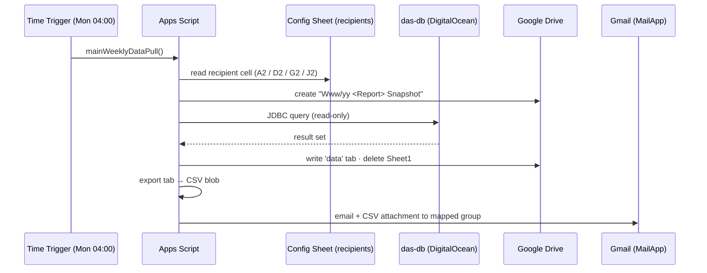

# 🤖 Automated Report Distribution (Google Apps Script)

!!! quote "Why this exists"
    These automations are the **production implementation** of the
    [Email Distribution & Automation Mapping](email-distribution.md): they extract data
    from `das-db`, snapshot it to Google Drive, and email CSVs to the mapped stakeholder
    groups — fulfilling **BI OKR 2** (*provide raw data to each department*).

---

## 1. Automation Registry

| ID | Script | Cadence · Trigger | BU Scope | Output Filename | Drive Folder | Recipients Cell | Source |
|---|---|---|---|---|---|---|---|
| GAS-01 | M-Kitchen Master Data | Weekly · Mon 04:00 | M-Kitchen | `Www/yy M-Kitchen Master Data Snapshot` | `1ADh…SSm` | `A2` | [json](../assets/scripts/m-kitchen-master-data-weekly.json) |
| GAS-02 | M-Trading Master Data | Weekly · Mon 04:00 | M-Trading (Food) | `Www/yy M-Trading Master Data Snapshot` | `1KNw…Xt6` | `D2` | [json](../assets/scripts/m-trading-master-data-weekly.json) |
| GAS-03 | M-Kitchen Product Pricelist | Weekly · Mon 04:00 | M-Kitchen | `Www/yy M-Kitchen Product Pricelist` | `1WY4…Saa` | `J2` | [json](../assets/scripts/m-kitchen-pricelist-weekly.json) |
| GAS-04 | M-Kitchen → M-Express Deliveries | Monthly · **manual trigger ⚠️** | M-Kitchen invoices | `[MMM] M-Kitchen --> M-Express Deliveries Master Data Snapshot` | `1rla…F5T` | `G2` | [json](../assets/scripts/m-express-deliveries-monthly.json) |

**Shared configuration:**

| Setting | Value |
|---|---|
| Database | `das-db` @ `db-distribution-accounting-do-user-2718740-0.h.db.ondigitalocean.com:25060` (DigitalOcean MySQL) |
| Recipients sheet | Spreadsheet `17Bxua…hz_o` — each script reads its TO-list from its own cell (A2/D2/G2/J2) |
| Timezone | `Asia/Yangon` |

!!! warning "GAS-04 has no trigger function"
    The monthly script ships **without** `createWeeklyTrigger`. Create its trigger
    manually (see §6) or add the `createMonthlyTrigger()` snippet below.

---

## 2. Runtime Architecture



### What each script delivers

| Script | Key Outputs |
|---|---|
| GAS-01 / GAS-02 | Master-data health: `MasterdataAlert` (shelf-life / brand / batch / expiry checks), 3-level categories, account names, `purchased_sku` lineage, Kit/Supplier source |
| GAS-03 | Full pricelist: catalogue/corp/B2B prices & margins, last-PO & purchasing price, conversion rates, 30-day market survey averages (Retail/Street/B2B), `Price_Alert` flags (price increase, negative margin, missing catalogue price) |
| GAS-04 | Delivery volume per invoice: `TotalQty`, `InvoiceTotalWeight`, delivery method, invoice month — feeds M-Express KPIs (K-ME-01…03) |

---

## 3. Changing Recipients (No Code Edits)

1. Open the shared config spreadsheet `17Bxua…hz_o`.
2. Edit the cell for the target script (A2 / D2 / G2 / J2) — comma-separated emails.
3. Save. The next scheduled run picks it up automatically.

> This is the live equivalent of the `dim_report_email_map` concept — the sheet is the
> single source of truth for distribution lists.

---

## 4. Onboarding a New Automated Report

1. Copy an existing script project (template = GAS-01).
2. Replace the SQL in `QUERIES_TO_RUN` and the `sheetName`.
3. Create a **new Drive folder** and set `FOLDER_ID`.
4. Reserve a **new recipients cell** in the config sheet and update `TAB_ID`/range.
5. Rename the `baseName` pattern (e.g. `'Www/yy <Report>'`).
6. Run `createWeeklyTrigger()` once and authorize scopes (`Jdbc`, `Drive`, `Sheets`, `Mail`).
7. Register the new automation in §1 of this page and in the [Master Report Catalog](../projects/daily-routine.md).

---

## 5. 🔐 Security Hardening (P0)

!!! danger "Hardcoded credentials"
    All four scripts currently embed DB usernames/passwords in source. These files have
    been shared externally — **treat the passwords as exposed and rotate them**, then
    move secrets to Script Properties.

```js
// BEFORE (insecure)
const DB_USER = 'thansoeaung';
const DB_PASSWORD = 'xxxx';

// AFTER (secure)
const props = PropertiesService.getScriptProperties();
const DB_USER = props.getProperty('DB_USER');
const DB_PASSWORD = props.getProperty('DB_PASSWORD');
```

Set values once via **Apps Script Editor → Project Settings → Script Properties**
(or a one-time setup function), then delete the literals.

Additional controls:

- Use a **read-only** MySQL user for reporting (no INSERT/UPDATE/DDL grants).
- Run all scripts from a **dedicated service account** (e.g. `bi.automation@marathonmyanmar.com`) so triggers survive staff turnover.
- Keep the DigitalOcean DB firewall restricted to known egress IPs.

---

## 6. Reliability Fixes (P1)

### 6.1 Failure alerts (currently errors are only logged)

```js
} catch (e) {
  Logger.log(`An error occurred: ${e.message}\nStack: ${e.stack}`);
  MailApp.sendEmail({
    to: 'bi.team@marathonmyanmar.com',
    subject: `⚠️ AUTOMATION FAILURE: ${baseName || 'Scheduled report'}`,
    body: `The scheduled data pull failed.\n\nError: ${e.message}\n\nCheck Apps Script → Executions.`
  });
}
```

### 6.2 Missing monthly trigger for GAS-04

```js
function createMonthlyTrigger() {
  ScriptApp.getProjectTriggers().forEach(t => {
    if (t.getHandlerFunction() === 'mainMonthlyDataPull') ScriptApp.deleteTrigger(t);
  });
  ScriptApp.newTrigger('mainMonthlyDataPull')
    .timeBased()
    .onMonthDay(1)          // 1st of month
    .atHour(4)              // 04:00–05:00
    .create();
}
```

### 6.3 Standardize `fetchData`

GAS-04's `fetchData` lacks `setQueryTimeout(300)` and null-handling present in GAS-01 —
copy the hardened version from GAS-01 into all scripts.

---

## 7. Mapping to the BI Framework

| Framework Item | Covered By |
|---|---|
| BI OKR 2 — raw data to departments | GAS-01…04 (weekly/monthly CSV drops) |
| Epic 3 — master data quality | `MasterdataAlert` columns in GAS-01/02 |
| Epic 4 — KPIs (K-ME-01…03, pricing KRs) | GAS-04 delivery volumes · GAS-03 margin & alert flags |
| Daily Routine — Report & Briefing | Snapshots archived in Drive serve as evidence trail |
| Email Distribution Mapping | Config-sheet recipient cells = live `dim_report_email_map` |

---

> [Email Distribution Mapping](email-distribution.md) · [ETL Guide](etl-guide.md) ·
> [Daily Routine](../projects/daily-routine.md) · [Data Governance](../policies/data-governance.md)