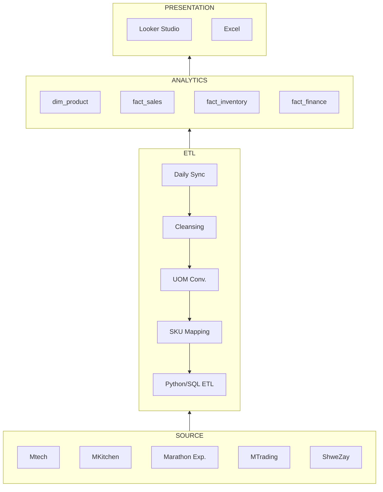

# 🔎 Insights & Findings

Notes from our reverse-engineering of the DAS system and our warehouse design decisions.

## 7 OLTP Anti-Patterns in `das-db`

| # | Finding | Example | ETL Impact |
|---|---|---|---|
| 1 | 1NF violation (list-in-column) | `accounts.branches` = comma IDs | Explode to junction tables |
| 2 | Missing explicit FKs | `account_transactions` | Orphan-risk validation |
| 3 | Type anomaly | `customer_credit_invoices.business_id` = `longtext` | Cast in ETL; indexes die |
| 4 | Redundant indexes | `sales_invoices` 7+ trees | Extract carefully |
| 5 | No partitioning | `stock_histories`, `account_transactions` | Chunked/date-bounded extracts |
| 6 | CDC as BLOB | `pub_sub_message_records.old_obj/new_obj` | Parse JSON in Python |
| 7 | Missing audit columns | `opening_stocks` | Full-refresh, not delta |

Full detail: [Epic 1 · Source Analysis](projects/epic-1-source-analysis.md).

## The Purpose of an ERP

!!! note "Single Source of Truth"
    An ERP unifies finance, inventory, delivery and HR into one cohesive database.
    For a multi-BU organization it ensures data flows seamlessly between departments,
    leadership sees real-time performance, and processes stay standardized, scalable
    and compliant. Our warehouse **extends** the ERP — it does not replace it.

## Pipeline Architecture

