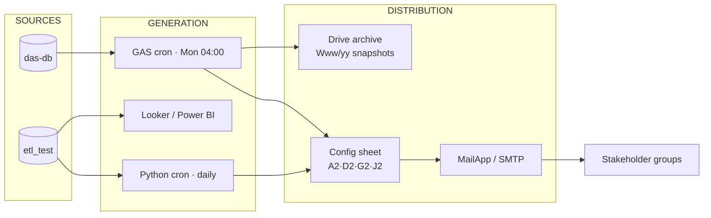

# 🗂️ Master Report Catalog

!!! quote "Catalog Rule"
    **Report Title is the primary key.** Every report maps to exactly one ID, one email
    group, one schedule and one owner — no orphan reports, no hardcoded recipients.

**Inventory:** 6 email-distributed reports (RPT) · 4 automated GAS snapshots (GAS) ·
6 dashboards (DASH) = **16 catalogued deliverables**.

---

## 0. How to Read This Catalog

| Field | Meaning |
|---|---|
| **ID** | Stable reference used in links, logs and the KPI framework |
| **Cadence** | Generation frequency + send time (Asia/Yangon) |
| **Audience** | Email group (TO) + oversight (CC) |
| **Source** | `das-db` tables or `etl_test` warehouse objects |
| **Status** | ✅ Production · 🚧 In build · 📋 Planned · ⚠️ Needs fix |

---

## 1. Catalog at a Glance

| ID | Title | Type | Cadence | Audience | Status |
|---|---|---|---|---|:---:|
| [RPT-001](#rpt-001) | Daily Sales Report | Email | Daily 08:00 | Sales Management | ✅ |
| [RPT-002](#rpt-002) | Weekly Sales Performance | Email | Mon 09:00 | Sales Management | ✅ |
| [RPT-003](#rpt-003) | Monthly Sales Report | Email | Monthly 10:00 | Management | ✅ |
| [RPT-004](#rpt-004) | Customer Analysis Report | Email | Fri 09:00 | CRM Team | ✅ |
| [RPT-005](#rpt-005) | Inventory Report | Email | Daily 08:30 | Operations Team | ✅ |
| [RPT-006](#rpt-006) | Finance Summary Report | Email | Monthly | Finance Team | 🚧 |
| [GAS-01](#gas-01) | M-Kitchen Master Data Snapshot | GAS | Mon 04:00 | Cell A2 group | ✅ |
| [GAS-02](#gas-02) | M-Trading Master Data Snapshot | GAS | Mon 04:00 | Cell D2 group | ✅ |
| [GAS-03](#gas-03) | M-Kitchen Product Pricelist | GAS | Mon 04:00 | Cell J2 group | ✅ |
| [GAS-04](#gas-04) | MK → M-Express Deliveries Snapshot | GAS | Monthly | Cell G2 group | ⚠️ |
| [DASH-01](#dash-01) | Executive Dashboard | Dashboard | Live | Leadership | 🚧 |
| [DASH-02](#dash-02) | KR Monitoring Board | Dashboard | Live | HODs | 📋 |
| [DASH-03](#dash-03) | ESG Dashboard | Dashboard | Monthly | Sustainability | 📋 |
| [DASH-04](#dash-04) | SLA ↔ KRs Sync Board | Dashboard | Live | Management | 📋 |
| [DASH-05](#dash-05) | Product Performance | Dashboard | Live | Sales/Ops | 🚧 |
| [DASH-06](#dash-06) | Delivery Operations | Dashboard | Live | M-Express | 📋 |

---

## 2. Email-Distributed Reports (RPT)

### RPT-001 — Daily Sales Report { #rpt-001 }

| Field | Value |
|---|---|
| Email group | **Sales Management** |
| TO | sales.manager@ · sales.team@ · regional.manager@company.com |
| CC | bi.team@company.com |
| Schedule | **Daily · 08:00** |
| Source | `etl_test.agg_product_sales` ⋈ `fact_saless` |
| Content | Revenue, gross profit, margin % by BU & category; vs-target delta |
| Owner | BI Lead |

### RPT-002 — Weekly Sales Performance { #rpt-002 }

| Field | Value |
|---|---|
| Email group | **Sales Management** |
| TO | sales.manager@ · regional.manager@company.com |
| CC | bi.team@ · management@company.com |
| Schedule | **Every Monday · 09:00** |
| Source | `fact_saless` (weekly aggregate) |
| Content | WoW trend, top/bottom 10 SKUs, cross-BU share, K-SZ-03 & K-MK-02 inputs |

### RPT-003 — Monthly Sales Report { #rpt-003 }

| Field | Value |
|---|---|
| Email group | **Management** |
| TO | management@ · finance.manager@ · sales.director@company.com |
| CC | bi.team@company.com |
| Schedule | **Monthly · 10:00** (1st working day) |
| Source | `fact_saless` + `agg_product_sales` (monthly rollup) |
| Content | BU P&L inputs, channel split (B2B/Corp/B2C), OKR-1 progress vs Lakhs targets |

### RPT-004 — Customer Analysis Report { #rpt-004 }

| Field | Value |
|---|---|
| Email group | **CRM Team** |
| Schedule | **Every Friday · 09:00** |
| Source | `das-db.customers` ⋈ `sales_invoices` ⋈ `customer_payments` |
| Content | ABC classes, churn flags, identified-customer % (K-SZ-02), payment-on-time (K-MK-01) |

### RPT-005 — Inventory Report { #rpt-005 }

| Field | Value |
|---|---|
| Email group | **Operations Team** |
| Schedule | **Daily · 08:30** |
| Source | `das-db.stock_summaries` ⋈ `stock_summary_daily_balances` |
| Content | Current stock, stock shortage % (K-MF-01), ageing buckets (K-SZ-01), FEFO expiry alerts (30/60/90 d) |

### RPT-006 — Finance Summary Report { #rpt-006 }

| Field | Value |
|---|---|
| Email group | **Finance Team** |
| Schedule | **Monthly** (by 15th, per K-FN-01 SLA) |
| Source | `das-db.account_transactions` ⋈ `banking_transactions` ⋈ `bills` |
| Content | Revenue & financial summary, AP/AR exposure, unreconciled bank items |
| Status | 🚧 Wiring to warehouse finance fact (Epic 3 scope) |

---

## 3. Automated GAS Snapshots (GAS)

!!! info "Shared platform"
    All four run on **Google Apps Script** (V8, `Asia/Yangon`), connect via JDBC to
    `das-db` @ DigitalOcean (`db-distribution-accounting-…ondigitalocean.com:25060`),
    write a `data` tab, export CSV and email it. Recipients are read from the shared
    config sheet `17Bxua…hz_o` — **never hardcoded**. Full runbook:
    [Report Automation (GAS)](../guides/report-automation.md).

### GAS-01 — M-Kitchen Master Data Snapshot { #gas-01 }

| Config | Value |
|---|---|
| Trigger | Weekly · **Monday 04:00–05:00** (`createWeeklyTrigger`) |
| Filename | `'W'ww/yy 'M-Kitchen Master Data Snapshot'` |
| Drive folder | `1ADhJd5JlN5Z3gHn7j4heX5O_4f65wSSm` |
| Recipients cell | **A2** · DB user `kmkyaw` |
| BU scope | M-Kitchen (`84093770-29ad-4e8e-9da1-babe583c0d69`) |

**Content & logic:** active goods (`nature='G'`, sellable/purchasable) with
`MasterdataAlert` flags — *Confirm shelf life* (<30 d), *Confirm brand name*,
*No batch tracking*, *No expiry date tracking* — 3-level categories, account names
(purchase/sales/inventory), and **Source** resolution: `Kit` → `M-Trading` →
`Repacking` → `M-Kitchen` via `purchased_sku` cross-BU joins.

### GAS-02 — M-Trading Master Data Snapshot { #gas-02 }

| Config | Value |
|---|---|
| Trigger | Weekly · Monday 04:00 |
| Filename | `'W'ww/yy 'M-Trading Master Data Snapshot'` |
| Drive folder | `1KNwNKApqaaKWj9LUjY7nwikQ3A9nXt6z` |
| Recipients cell | **D2** · DB user `thansoeaung` |
| BU scope | M-Trading Food (`7ef7c6c0-b59d-4be9-960c-7fa573038642`) |

Same master-data health logic as GAS-01; **Source** = `Kit` vs `Supplier`.

### GAS-03 — M-Kitchen Product Pricelist { #gas-03 }

| Config | Value |
|---|---|
| Trigger | Weekly · Monday 04:00 |
| Filename | `'W'ww/yy 'M-Kitchen Product Pricelist'` |
| Drive folder | `1WY4Thfn7-PYs-W1Mp8enLgrskPQR-Saa` |
| Recipients cell | **J2** · DB user `thansoeaung` |

**Content & logic (CTE chain):** `LatestPO` → `BaseData` → `SupplierSKULookup` →
`SurveyAverages` (30-day market survey: Retail / Street / B2B) → `PriceCalculation` →
`FinalCalculations`. Outputs conversion rates, purchasing vs last-PO price,
delivery cost (`weight × 300`), Catalogue/Corp/B2B prices, margins & discounts, and
**Price_Alert** flags:

| Alert | Meaning |
|---|---|
| `Purchasing price increased` | Calculated purchasing > last PO price |
| `Negative margin` | Lowest price < total cost |
| `Catalogue price not configured` | Sellable but catalogue = 1 |
| `No PO price known` / `No purchasing price` | Missing cost evidence |

### GAS-04 — MK → M-Express Deliveries Snapshot { #gas-04 }

| Config | Value |
|---|---|
| Trigger | **Monthly — manual trigger ⚠️** (add `createMonthlyTrigger`, see runbook 6.2) |
| Filename | `[MMM] 'M-Kitchen --> M-Express Deliveries Master Data Snapshot'` |
| Drive folder | `1rla_QZmXl6P6lV_2neApaaJY6QyF5T1o` |
| Recipients cell | **G2** · DB user `thansoeaung` |

**Content:** per invoice — `order_number`, `invoice_number`, `InvoiceMonth`,
`DeliveryMethod`, `TotalQty`, `InvoiceTotalWeight` (= Σ detail_qty × weight).
Feeds delivery KPIs **K-ME-01…03**.

---

## 4. Dashboards (DASH)

### DASH-01 — Executive Dashboard { #dash-01 }
Group revenue, margin, OKR progress (Lakhs), cross-BU heat map. *Looker Studio · Power BI.*

### DASH-02 — KR Monitoring Board { #dash-02 }
27 KPIs from [OKR & KPI Framework](../projects/epic-4-okr-kpi-framework.md) with
Fail/Target traffic lights; Monday 2 pm publication (K-BI-01).

### DASH-03 — ESG Dashboard { #dash-03 }
[Sustainability](../sustainability.md) metrics: bicycle %, women shares, reusable
packaging, tier-3 coverage, agent income.

### DASH-04 — SLA ↔ KRs Sync Board { #dash-04 }
SLA master sheet vs measured KRs — the Epic 4 executive deliverable.

### DASH-05 — Product Performance { #dash-05 }
SKU velocity, margin waterfalls, pricelist alerts (GAS-03), ABC classes.

### DASH-06 — Delivery Operations { #dash-06 }
On-time delivery (K-ME-01), weight per invoice (GAS-04), returns & retries.

---

## 5. Distribution Architecture

---

## 6. Recipient Governance

| Script / Report | Config cell | Change procedure |
|---|:---:|---|
| GAS-01 | A2 | Edit config sheet → effective next run |
| GAS-02 | D2 | Same |
| GAS-04 | G2 | Same |
| GAS-03 | J2 | Same |
| RPT-001…006 | `dim_report_email_map` | [Email Distribution 5](../guides/email-distribution.md) |

!!! warning "No hardcoded recipients"
    Adding a person = editing the config sheet / mapping table, **not** editing code.
    All changes are logged and reviewed at the monthly data-quality meeting.

---

## 7. Adding a New Report (Procedure)

1. Reserve the next ID (`RPT-007`, `GAS-05`, `DASH-07`) and define the **title (primary key)**.
2. Register recipients (TO/CC) in the config sheet or `dim_report_email_map`.
3. Implement generation (SQL view / GAS project / dashboard) and schedule.
4. Add the row to this catalog **before** first distribution.
5. Announce via [Announcements](../announcements.md); tag the ticket `report-request`.

---

## 8. Naming & Retention

- **Files:** `Www/yy <Report Title>` (weekly) · `[MMM] <Report Title>` (monthly)
- **Archive:** Drive folders per report; retain **24 months**, then move to cold storage
- **Subjects:** `Weekly Data Update: <filename>` (GAS standard)

---

## 9. Cross-Mapping to KPIs & OKRs

| Report | Feeds KPI | Supports OKR |
|---|---|---|
| RPT-001/002/003 | K-SZ-03, K-MK-02 | SZ-OKR1 · MK-OKR1 |
| RPT-004 | K-SZ-02, K-MK-01 | CRM quality |
| RPT-005 | K-MF-01, K-SZ-01 | MT-OKR1 |
| GAS-01/02 | Master-data health | BI-OKR2 |
| GAS-03 | Pricing/margin KRs | MK-OKR1 |
| GAS-04 | K-ME-01…03 | ME-OKR1/2 |
| DASH-02/04 | All 27 KPIs | BI-OKR1 |

> [Library Index](index.md) · [Email Distribution](../guides/email-distribution.md) ·
> [Report Automation](../guides/report-automation.md) · [OKR & KPI Framework](../projects/epic-4-okr-kpi-framework.md)