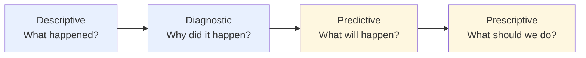

# 🌅 Daily Routine & Strategic Alignment

| ID | Task | Type | Status | Notes / Deliverable |
|---|---|---|:---:|---|
| D-1 | Report and Briefing | 🔁 | ✅ | Daily management briefing from refreshed dashboards |
| D-2 | KRs Monitoring Report | 🔁 | 🚧 | Key Results tracking; will sync with Epic 4 SLA board |
| D-3 | Analytics | 🔁 | ✅ | Ad-hoc analysis on `etl_test` (`fact_saless`, `agg_product_sales`) |
| D-4 | Build Master Report Catalog | 🚧 | 🚧 | Index of all standardized reports (descriptive → prescriptive) |
| D-5 | Descriptive & diagnostic report setting | 🚧 | 🚧 | "What happened / why" — sales, margin, stock, cross-BU |
| D-6 | Predictive & prescriptive report setting | 📋 |  | "What will happen / what to do" — forecast, reorder, FEFO alerts |

## Analytics Maturity Ladder

!!! tip "Current focus"
    Descriptive/diagnostic reports are being standardized on top of `agg_product_sales`
    (revenue, margin, cross-BU share). Predictive/prescriptive layers start after
    Epic 3 UOM/conversion work completes.