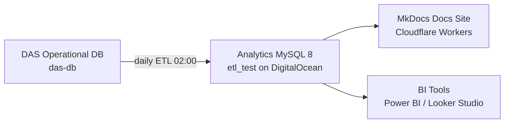

# 🔄 Epic 2 — Infrastructure & ETL Pipeline Architecture

| ID | Task | Status | Notes |
|---|---|:---:|---|
| E2-1 | Proposal: analytics DB on current hosting (DigitalOcean) | ✅ | Proposal drafted (below) |
| E2-2 | Follow with IT team for production DB | 🚧 | Pending provisioning & credentials |

## Hosting Proposal (Summary)

| Component | Decision | Rationale |
|---|---|---|
| Engine | MySQL 8.0 | Window functions (`ROW_NUMBER`, `DENSE_RANK`) required by Pipeline A |
| Collation | `utf8mb4_0900_ai_ci` | Matches `das-db`; avoids collation errors on joins |
| Schema | `etl_test` → rename `bi_database` at go-live | Clean promotion path |
| Refresh | Daily 02:00, chunked | See [ETL Runbook](../policies/etl-runbook.md) |
| Access gate | Cloudflare Access (`@marathonmyanmar.com`) | See [Data Usage Terms](../terms/data-usage.md) |

!!! warning "Open item"
    Production DB provisioning (E2-2) is the gate for go-live. Until IT completes it,
    all work continues on the local `etl_test` environment.