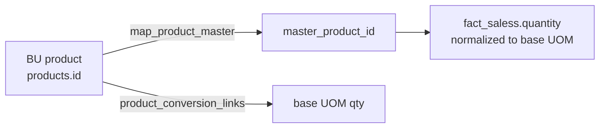

# 🏗️ Epic 3 — MDM & Data Warehouse Build

| ID | Task | Status | Deliverable / Reference |
|---|---|:---:|---|
| E3-1 | Create master products list | ✅ | `dim_master_products` — 18,906 golden records · [ETL 4](../guides/etl-guide.md) |
| E3-2 | Detect strings (regex) causing name mismatch | ✅ | Normalization: `UPPER`, `*→X`, strip spaces · [ETL 4.1](../guides/etl-guide.md) |
| E3-3 | Extract all products from all sources | ✅ | Staging + bridge from `das-db.products` (47,121 rows audited) |
| E3-4 | Detect UOMs | 🚧 | Source: `product_units`, `master_product_units` |
| E3-5 | Define Base UOMs | 📋 | Base = PCS; standardize decimals via `precision` |
| E3-6 | Create auto-generated SKU for DW | 📋 | Design pattern: `[BU]-[CAT]-[SEQ]-[UOM]` (chronological) |
| E3-7 | Design SKU generating system | 📋 | Chronological + Product + UOM + BU segments |
| E3-8 | Create mapping across analytical dimensions | ✅ | `bridge_product_mapping` + `map_product_master` · [ETL 4–5](../guides/etl-guide.md) |
| E3-9 | Create conversion factors per SKU & BU | 📋 | Source: `product_conversion_links` (`qty → to_qty`) |

## UOM & Conversion Design (Planned)

!!! note "Rules carried from Pipeline A"
    Matching priority: **barcode → sku**. Golden record order:
    `is_active DESC → updated_at DESC → created_at DESC → id DESC`.