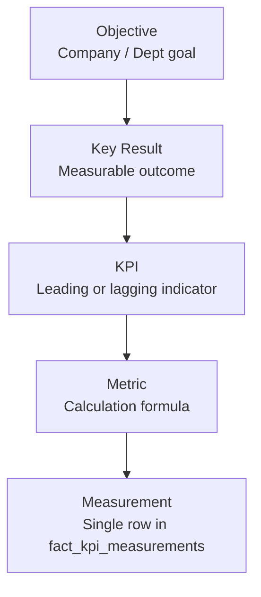
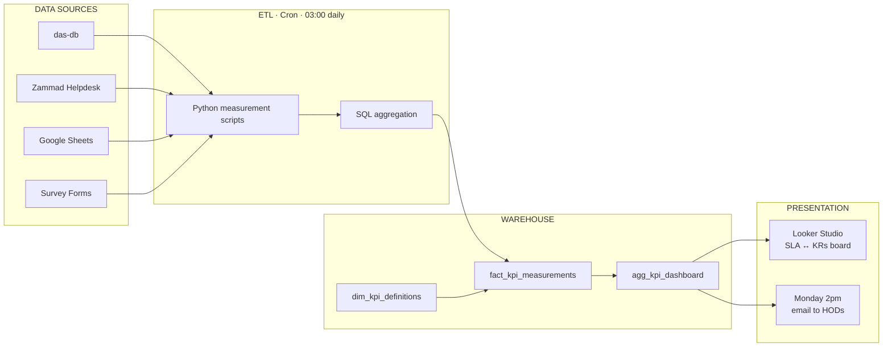

# ⚖️ Epic 4 — OKR & KPI Framework

!!! quote "Strategic Mandate"
    **BI OKR 1 (60%)** — *Department KPIs automation/dashboard*
    **BI OKR 2 (40%)** — *Prepare and provide raw data to each department for their monthly analyses*

This document converts the **8-department OKR plan** and **32 existing KPIs** into a
structured, automation-ready framework. It replaces the manual "Monday 2 pm" Excel
file with a **measured, auditable, defensible** system backed by the data warehouse.

---

## 1. OKR Hierarchy — The Taxonomy

Every KPI in this framework traces upward through a strict 5-level chain:



### 1.1 Marathon Corporate Objectives (derived from department OKRs)

| # | Objective | Weight | Owner |
|---|---|---|---|
| O1 | Grow retail & B2B revenue across BUs | 40% | CEO |
| O2 | Expand geographic footprint (Yangon, Singapore) | 20% | COO |
| O3 | Digitize operations end-to-end (DAS adoption) | 20% | CTO |
| O4 | Strengthen financial discipline & compliance | 10% | CFO |
| O5 | Build data-driven culture across departments | 10% | BI Lead |

### 1.2 Department OKRs → Key Results Matrix

| Dept | OKR 1 (weight) | OKR 2 (weight) |
|---|---|---|
| **Shwe Zay** | Retail sales 3,000 Lakhs (60%) | Open 1 new Yangon store + B2C grocery delivery (40%) |
| **M-Kitchen** | Total sales 4,000 Lakhs · B2B 2,000 · Corporate 2,000 (70%) | 3-month rolling sales forecast for all channels (30%) |
| **M-Express** | Launch delivery for 5 MM online shops to Singapore (50%) | B2C grocery delivery in Yangon w/ Shwe Zay + M-Kitchen (50%) |
| **M-Trading** | DAS inventory live for oil distribution w/ payment status (50%) | Launch 10–15 new food products (50%) |
| **M-Tech** | Onboard 3 Pop & Mom pilot customers (60%) | DAS catalogue + pricing portal for SZ / MK (40%) |
| **Finance** | Finalize Marathon 2025 balance sheet (60%) | Clean monthly P&L for all departments (40%) |
| **BI** | Department KPIs automation / dashboard (60%) | Provide raw data monthly to every dept (40%) |
| **Admin & HR** | Train 70% of non-Yangon employees (50%) | Roll out benefits plan + on/offboarding SOPs (50%) |

---

## 2. KPI Master Sheet — Enhanced Version

The existing 32-row KPI table is upgraded with **3 critical columns**:
`data_source_automation`, `measurement_owner`, `kpi_id` (primary key).

### 2.1 KPI Taxonomy — SLA · Quality · Efficiency

Every department has **one KPI of each type**, creating a balanced scorecard:

- **SLA** = service-level timeliness / compliance
- **Quality** = output excellence / customer impact
- **Efficiency** = productivity per employee or resource

### 2.2 Enhanced KPI Master Sheet

| kpi_id | Dept | Type | KPI | Source System | Automated? | Calculation | Freq | Fail | Target | Current |
|---|---|---|---|---|:---:|---|---|---|---|---|
| K-MK-01 | M-Kitchen | SLA | Payment on time | `das-db.sales_invoices` | ✅ | Paid within due date ÷ total paid | Weekly | 70% | 80% | 17% |
| K-MK-02 | M-Kitchen | Quality | SO per active customer | `das-db.sales_orders` | ✅ | Customers with ≥2 SOs in 90d | Weekly | 1.2 | 1.5 | 1.29 |
| K-MK-03 | M-Kitchen | Efficiency | SO per employee | `das-db.sales_orders` + `employees` | ✅ | Closed SOs ÷ active FTEs | Weekly | 10 | 12 | 9 |
| K-SZ-01 | Shwe Zay | SLA | Ageing stock % | `das-db.stock_summaries` | 🚧 | Ageing items ÷ total items | Weekly | 60% | 70% | — |
| K-SZ-02 | Shwe Zay | Quality | Identified customer % | `das-db.sales_invoices` | ✅ | Txn with account ÷ total txn | Weekly | 40% | 60% | 33.69% |
| K-SZ-03 | Shwe Zay | Efficiency | Sales txn per employee | `das-db.sales_invoices` + `employees` | ✅ | Transactions ÷ FTEs | Weekly | 438 | 480 | 438 |
| K-MT-01 | M-Tech | SLA | Issue resolution on time | `zammad.fact_support_tickets` | ✅ | Resolved within SLA ÷ resolved | Weekly | 20% | 40% | 15% |
| K-MT-02 | M-Tech | Quality | Ageing issue tickets | `zammad.fact_support_tickets` | ✅ | Ageing open ÷ ongoing open | Weekly | 40% | 60% | 12% |
| K-MT-03 | M-Tech | Efficiency | Features per employee | `zammad.fact_support_tickets` | ✅ | Closed feature tickets ÷ FTEs / qtr | Quarterly | 7 | 10 | 4.2 |
| K-ME-01 | M-Express | SLA | Delivery on time | `marathon_express.deliveries` | 🚧 | Delivered in N days ÷ total | Weekly | 88% | 95% | 88% |
| K-ME-02 | M-Express | Quality | Delivery rating | `marathon_express.reviews` | 🚧 | Avg customer rating (1–5) | Weekly | 3 | 3.5 | — |
| K-ME-03 | M-Express | Efficiency | Delivery orders per emp | `marathon_express.deliveries` | 🚧 | Orders delivered ÷ FTEs | Weekly | 67 | 80 | 67 |
| K-MF-01 | M-Trading FMCG | SLA | Stock shortage % | `das-db.stock_summaries` | ✅ | SKUs w/ 0 stock ÷ stored SKUs | Weekly | 40% | 30% | 71.43% |
| K-MF-02 | M-Trading FMCG | Quality | Product quality score | Survey → `fact_survey_responses` | 🚧 | Avg user rating (1–5) | Monthly | 3 | 3.5 | — |
| K-MF-03 | M-Trading FMCG | Efficiency | Trade per employee | `das-db.sales_invoices` + `employees` | ✅ | Qty sold to BUs ÷ FTEs | Weekly | 0.20 | 0.30 | 47 |
| K-MO-01 | M-Trading Oil | SLA | Payment on time | `google_sheets.oil_sales` | ⚠️ | Paid within due date ÷ total | Weekly | 70% | 100% | — |
| K-MO-02 | M-Trading Oil | Quality | Complaint rate | `google_sheets.oil_shortages` | ⚠️ | Shortage rows ÷ total rows | Weekly | 0% | 100% | — |
| K-MO-03 | M-Trading Oil | Efficiency | Damage rate | `google_sheets.drum_damage` | ⚠️ | Damaged qty ÷ sold qty | Weekly | 100% | 75% | — |
| K-FN-01 | Finance | SLA | On-time reports | `bi.fact_report_log` | ✅ | Reports posted by 15th ÷ total | Monthly | 0% | 100% | — |
| K-FN-02 | Finance | Quality | Blank cheque + audit | Manual audit log | ⚠️ | Weighted formula (cheque 50% + audit 50%) | Weekly | 0% | 100% | — |
| K-FN-03 | Finance | Efficiency | Fraud cases | Daily bank PDF | ⚠️ | Count of cases; 0 cases = 100% | Daily | 0% | 100% | — |
| K-BI-01 | BI | SLA | KPIs published on time | `bi.fact_report_log` | ✅ | Published by Mon 2 pm ÷ scheduled | Weekly | 0 | 5 | — |
| K-BI-02 | BI | Quality | Ticket quality survey | `zammad.fact_support_tickets` | ✅ | Dept score on BI projects (1–5) | Monthly | 2.5 | 3.5 | — |
| K-BI-03 | BI | Efficiency | Marathon efficiency | Cross-dept aggregate | ✅ | Average of all dept efficiency KPIs | Weekly | 50% | 100% | — |
| K-HR-01 | Admin & HR | SLA | Onboarding on time | `das-db.employees` | ✅ | Ready ÷ onboarded (SLA 2 wks) | Monthly | 0% | 100% | — |
| K-HR-02 | Admin & HR | Quality | Employee satisfaction | Survey → `fact_survey_responses` | 🚧 | Avg rating (1–5); fraud 50% + survey 50% | Monthly | 3.83 | 4 | 3.83 |
| K-HR-03 | Admin & HR | Efficiency | Employee working time | `das-db.attendance_logs` | ✅ | Hours ÷ working days | Monthly | 6.7 | 7.2 | 6.4 |

### 2.3 Automation Status Legend

| Icon | Meaning | Action Required |
|:---:|---|---|
| ✅ | Fully automated via warehouse + cron | Production-ready |
| 🚧 | Build scheduled in Epic 4 | Schedule in sprint |
| ⚠️ | External/manual source | Migrate to warehouse |
| ❌ | Not yet designed | Design + scope |

**Current maturity:** 14 ✅ automated · 5 🚧 in progress · 8 ⚠️ manual

---

## 3. Data Model — KPI Warehouse Tables

### 3.1 `dim_kpi_definitions` — Master KPI Registry

```sql
CREATE TABLE etl_test.dim_kpi_definitions (
    kpi_id             VARCHAR(20) PRIMARY KEY,   -- e.g. 'K-MK-01'
    department         VARCHAR(50) NOT NULL,
    kpi_type           ENUM('SLA','Quality','Efficiency') NOT NULL,
    kpi_name           VARCHAR(255) NOT NULL,
    source_system      VARCHAR(100) NOT NULL,     -- das-db / zammad / gsheet / manual
    calculation_sql    TEXT,                       -- executable query for automation
    measurement_frequency ENUM('Daily','Weekly','Monthly','Quarterly') NOT NULL,
    fail_threshold     DECIMAL(10,4) NOT NULL,
    success_threshold  DECIMAL(10,4) NOT NULL,
    unit_of_measure    VARCHAR(50),               -- '%', 'count', 'ratio', 'lakhs', 'score'
    objective_id       VARCHAR(20),               -- links to O1..O5
    key_result         VARCHAR(255),
    is_active          TINYINT(1) DEFAULT 1,
    measurement_owner  VARCHAR(100),              -- accountable person
    last_updated_at    DATETIME(3) DEFAULT CURRENT_TIMESTAMP(3)
        ON UPDATE CURRENT_TIMESTAMP(3),
    INDEX idx_kpi_dept (department),
    INDEX idx_kpi_type (kpi_type),
    INDEX idx_kpi_obj  (objective_id)
) ENGINE=InnoDB DEFAULT CHARSET=utf8mb4 COLLATE=utf8mb4_0900_ai_ci;
```

### 3.2 `fact_kpi_measurements` — Every Measurement as a Fact Row

```sql
CREATE TABLE etl_test.fact_kpi_measurements (
    measurement_id     BIGINT AUTO_INCREMENT PRIMARY KEY,
    kpi_id             VARCHAR(20) NOT NULL,
    measurement_date   DATE NOT NULL,
    period_type        ENUM('Daily','Weekly','Monthly','Quarterly') NOT NULL,
    numerator          DECIMAL(20,4),
    denominator        DECIMAL(20,4),
    actual_value       DECIMAL(20,4) NOT NULL,
    fail_threshold     DECIMAL(20,4),
    success_threshold  DECIMAL(20,4),
    status             ENUM('FAIL','AT_RISK','ON_TRACK','SUCCESS') NOT NULL,
    measurement_source VARCHAR(100),              -- 'cron:python', 'manual:thibaut', etc.
    evidence_url       VARCHAR(500),              -- link to source dashboard / report
    measured_by        VARCHAR(100),
    measured_at        DATETIME(3) DEFAULT CURRENT_TIMESTAMP(3),
    UNIQUE KEY uq_kpi_period (kpi_id, measurement_date, period_type),
    INDEX idx_kpi_date (kpi_id, measurement_date),
    INDEX idx_kpi_status (status),
    CONSTRAINT fk_fact_kpi_def FOREIGN KEY (kpi_id)
        REFERENCES dim_kpi_definitions(kpi_id)
) ENGINE=InnoDB DEFAULT CHARSET=utf8mb4 COLLATE=utf8mb4_0900_ai_ci;
```

### 3.3 `dim_okr_objectives` — Objective & KR Reference

```sql
CREATE TABLE etl_test.dim_okr_objectives (
    objective_id       VARCHAR(20) PRIMARY KEY,   -- 'O1'..'O5'
    department         VARCHAR(50),
    okr_number         TINYINT,                   -- 1 or 2
    weight_pct         DECIMAL(5,2) NOT NULL,
    description        TEXT NOT NULL,
    key_result_1       TEXT,
    key_result_2       TEXT,
    period             VARCHAR(20),               -- '2026-Q3'
    owner_role         VARCHAR(100)
) ENGINE=InnoDB DEFAULT CHARSET=utf8mb4 COLLATE=utf8mb4_0900_ai_ci;
```

---

## 4. Automation Pipeline — From "Monday File" to Cron



### 4.1 Sample Automation Script — `K-MK-01` Payment on Time

```python
# scripts/measure_kpis.py  (runs daily at 03:00)
import mysql.connector, datetime
from dateutil.relativedelta import relativedelta

def measure_k_mk_01(cursor, measurement_date):
    """K-MK-01: Payment on time — M-Kitchen"""
    sql = """
        SELECT
            COUNT(*) AS total_paid,
            SUM(CASE WHEN paid_within_due_date = 1 THEN 1 ELSE 0 END) AS on_time
        FROM (
            SELECT
                si.id,
                CASE WHEN cp.payment_date <= si.invoice_due_date
                     THEN 1 ELSE 0 END AS paid_within_due_date
            FROM `das-db`.sales_invoices si
            INNER JOIN `das-db`.customer_payments cp
                ON cp.customer_id = si.customer_id
               AND cp.business_id  = si.business_id
            WHERE si.business_id = (SELECT id FROM `das-db`.businesses WHERE code='mkitchen')
              AND si.invoice_date BETWEEN %s AND %s
              AND si.current_status IN ('Paid','Partial Paid')
        ) sub
    """
    week_start = measurement_date - datetime.timedelta(days=7)
    cursor.execute(sql, (week_start, measurement_date))
    row = cursor.fetchone()
    total, on_time = row
    actual = (on_time / total * 100) if total else 0

    cursor.execute("""
        INSERT INTO etl_test.fact_kpi_measurements
            (kpi_id, measurement_date, period_type, numerator, denominator,
             actual_value, fail_threshold, success_threshold, status,
             measurement_source, measured_by)
        VALUES (%s, %s, 'Weekly', %s, %s, %s, 70, 80,
                CASE WHEN %s >= 80 THEN 'SUCCESS'
                     WHEN %s >= 70 THEN 'ON_TRACK'
                     ELSE 'FAIL' END,
                'cron:python:K-MK-01', 'bi-service-account')
        ON DUPLICATE KEY UPDATE
            numerator = VALUES(numerator),
            denominator = VALUES(denominator),
            actual_value = VALUES(actual_value),
            status = VALUES(status),
            measured_at = CURRENT_TIMESTAMP(3)
    """, ('K-MK-01', measurement_date, on_time, total, actual, actual, actual))
```

### 4.2 Cron Schedule (Linux / `cron.d/marathon-bi`)

```
0 3 * * *   marathon   /opt/bi/scripts/measure_kpis.py --all        # Daily full run
0 9 * * 1   marathon   /opt/bi/scripts/publish_hod_report.py        # Mon 9 am email
```

---

## 5. SLA ↔ KR Synchronization Dashboard (Looker Studio)

### 5.1 Page 1 — Executive Scorecard

| Card | Content |
|---|---|
| **Corporate OKR progress** | Weighted progress bar per O1–O5 |
| **Dept KR traffic light** | 8 departments × 2 OKRs = 16 KR tiles |
| **KPI health by type** | SLA / Quality / Efficiency pie with red/amber/green |
| **Trend sparklines** | Last 12 weeks of top 5 KPIs |

### 5.2 Page 2 — Department Drill-Down

One page per department with:
- Current OKR weight split
- 3 KPI cards (SLA / Quality / Efficiency) with actual vs target
- 12-week trend chart
- Source table of recent measurements with `evidence_url` drill-through

### 5.3 Page 3 — Anomaly & Action Board

Auto-filtered list where `status = FAIL` OR `actual_value < fail_threshold × 1.1`:
- KPI ID, Department, Current, Target, Gap, Owner, Days in Fail state

---

## 6. Immediate Actions — Priority Order

### P0 — This Sprint (unblocks Epic 4)

- [ ] Create `dim_kpi_definitions` + `fact_kpi_measurements` tables
- [ ] Load all 27 existing KPIs as seed rows
- [ ] Automate the 14 ✅ KPIs with Python cron scripts
- [ ] Publish Monday 2pm email from warehouse (replacing Thibaut's file)

### P1 — Next Sprint (close automation gaps)

- [ ] Migrate M-Express delivery data into warehouse (🚧 KPIs)
- [ ] Build stock-ageing logic for Shwe Zay (K-SZ-01)
- [ ] Integrate Zammad `fact_support_tickets` (Epic 5 output) into K-MT-01..03
- [ ] Deploy product-quality survey for M-Trading FMCG

### P2 — Next Month (manual → automated)

- [ ] Replace Google Sheets for M-Trading Oil with DAS capture (K-MO-01..03)
- [ ] Build fraud-detection ingest for Finance daily bank PDF (K-FN-03)
- [ ] Automate blank-cheque audit via RBAC logs (K-FN-02)

### P3 — Next Quarter

- [ ] Build Looker Studio SLA ↔ KR board (pages 1–3 above)
- [ ] Predictive KPIs — add forecast column to `dim_kpi_definitions`
- [ ] Wire KPIs into the JIRA/OKR tool for automatic OKR scoring

---

## 7. Governance

| Decision | Owner | Cadence |
|---|---|---|
| Add / change KPI definition | BI Lead + Dept HOD | Monthly KPI review |
| Adjust fail/success thresholds | Dept HOD + CFO | Quarterly OKR reset |
| Retire obsolete KPI | Data Governance Committee | Annual review |
| Audit measurement accuracy | Internal Audit (Finance) | Quarterly |

> [← Back to Epic 4 Overview](epic-4-performance-bi.md) · [Zammad Integration](epic-5-zammad-integration.md) · [ETL Guide](../guides/etl-guide.md)