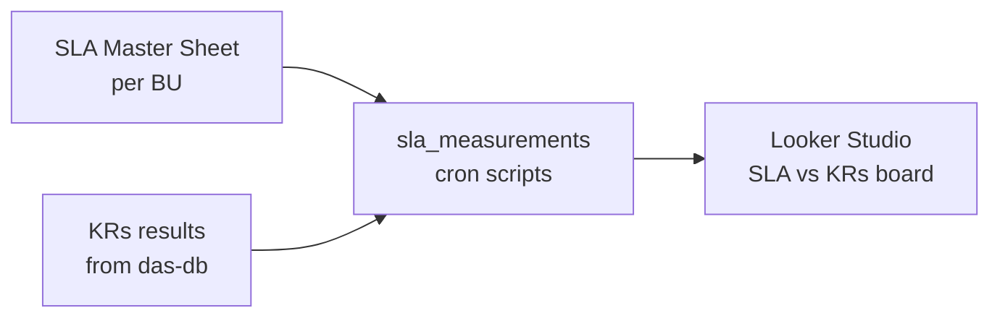

# 📊 Epic 4 — Performance Management (OKRs, KPIs & BI Delivery)

| ID | Task | Status | Notes |
|---|---|:---:|---|
| E4-1 | KPI DB Modeling | 🚧 | Started via `agg_product_sales`; extend to customer/inventory KPIs |
| E4-2 | KRs milestones intro | 📋 | Document KR definitions & owners per BU |
| E4-3 | Extract KRs results by querying `das-db` | 📋 | Reuse Pipeline B query patterns |
| E4-4 | Map SLA vs actual KRs | 📋 | Join SLA master sheet to measured results |
| E4-5 | Create SLA master sheet per BU | 📋 | One row per SLA term × BU, with thresholds |
| E4-6 | Measurement scripts as cronjobs | 📋 | Python/SQL cron → `sla_measurements` table |
| E4-7 | Looker Studio dashboard (SLA ↔ KRs sync) | 📋 | Final executive deliverable |

## Target Architecture

!!! tip "Dependency"
    Epic 4 accuracy depends on Epic 3 completion (unified SKUs & UOMs) —
    KRs that span BUs cannot be measured reliably before master mapping covers ≥ 95%.