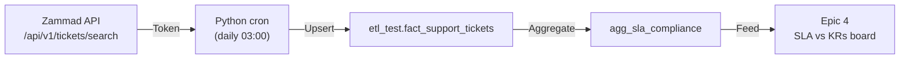

# 🎫 Epic 5 — Support Operations & Ticket Management (Zammad)

!!! info "System Target"
    **URL:** [techsupport.marathonmyanmar.com](https://techsupport.marathonmyanmar.com)
    **Platform:** Zammad 6.5.2 (PostgreSQL 14.23 / Redis 6.0.16 / Elasticsearch 7.17)
    **Current Volume:** 401 tickets (76 Open / 325 Closed) · 16 Agents · 58 Requesters

This Epic operationalizes the internal helpdesk as the intake channel for data corrections,
report requests and access issues, and pipes ticket data into the warehouse.

!!! tip "Relationship to Epic 4"
    **Epic 5 produces the ticket data; [Epic 4](epic-4-performance-bi.md) consumes it.**
    Support-ticket SLAs measured here feed the Epic 4 SLA ↔ KRs executive board.

---

## 1. System Health & Audit Findings

| Component | Status | Evidence |
|---|:---:|---|
| Database (PostgreSQL) | 🟢 Healthy | 282 MB DB + 257 MB attachments |
| Search (Elasticsearch) | 🟢 Healthy | ES 7.17, 11,833 history events |
| Cache (Redis) | 🟠 Warning | `mem_fragmentation_ratio: 5.94`; keyspace hit < 1% |
| Ticket Volume | 🟢 Active | 81% closure rate |
| Email Channel | 🟢 Healthy | 0 failed emails |

---

## 2. Configuration Blockers (Fix Before ETL)

!!! danger "P0 Blockers"
    The warehouse cannot measure support SLAs until these are configured in Zammad Admin.

### Blocker A — Missing SLA Definitions (`Sla: 0`)

| SLA Name | First Response | Resolution | Target Group |
|---|---|---|---|
| `SLA_DataCorrection` | 2 h | 1 working day | Data / BI |
| `SLA_ReportRequest` | 4 h | 2 working days | BI / Reports |
| `SLA_AccessSecurity` | 1 h | 4 h | IT / Security |
| `SLA_GeneralInquiry` | 4 h | 2 working days | Support |

### Blocker B — Time Accounting Disabled
Enable **Time Accounting** + define activity types (*Investigation, SQL Writing, Dashboard Build*)
so agent effort can be measured.

---

## 3. Data Model: `fact_support_tickets`

```sql
CREATE TABLE etl_test.fact_support_tickets (
    ticket_id          BIGINT PRIMARY KEY,
    ticket_number      VARCHAR(50),
    title              VARCHAR(255),
    state_bucket       VARCHAR(20),      -- OPEN / PENDING / CLOSED / MERGED
    priority           VARCHAR(50),
    group_name         VARCHAR(100),
    owner_name         VARCHAR(100),
    customer_bu_code   VARCHAR(50),
    created_at         DATETIME(3),
    first_response_at  DATETIME(3),
    closed_at          DATETIME(3),
    first_response_min INT GENERATED ALWAYS AS
        (TIMESTAMPDIFF(MINUTE, created_at, first_response_at)) STORED,
    resolution_min     INT GENERATED ALWAYS AS
        (TIMESTAMPDIFF(MINUTE, created_at, closed_at)) STORED,
    article_count      INT,
    time_units_logged  DECIMAL(10,2),
    sla_name           VARCHAR(100),
    sla_fr_met         TINYINT(1),
    sla_res_met        TINYINT(1),
    etl_loaded_at      DATETIME(3) DEFAULT CURRENT_TIMESTAMP(3),
    INDEX idx_fst_created (created_at),
    INDEX idx_fst_state   (state_bucket),
    INDEX idx_fst_group   (group_name)
) ENGINE=InnoDB DEFAULT CHARSET=utf8mb4 COLLATE=utf8mb4_0900_ai_ci;
```

---

## 4. ETL Pipeline & Epic 4 Hand-off



| Epic 4 KPI | Zammad Source | Column |
|---|---|---|
| First-response within SLA | `first_response_at − created_at` vs SLA | `sla_fr_met` |
| Resolution within SLA | `closed_at − created_at` vs SLA | `sla_res_met` |
| Backlog | Open/Pending count by group | `state_bucket` |
| Reopen rate | `closed → open` transitions | history |
| Agent utilization | time accounting | `time_units_logged` |

---

## 5. Implementation Checklist

- [ ] **P0:** Define the 4 core SLAs in Zammad Admin
- [ ] **P0:** Enable Time Accounting + activity types
- [ ] **P1:** Create dedicated Groups (Data / Reports / Security)
- [ ] **P1:** Issue a scoped BI service token (not a personal admin token)
- [ ] **P2:** Build & test the Python extraction script
- [ ] **P2:** Deploy as daily cronjob (03:00, post-ERP sync)
- [ ] **P3:** Enable Redis `activedefrag` to fix fragmentation
- [ ] **P3:** Wire `agg_sla_compliance` into the [Epic 4](epic-4-performance-bi.md) board