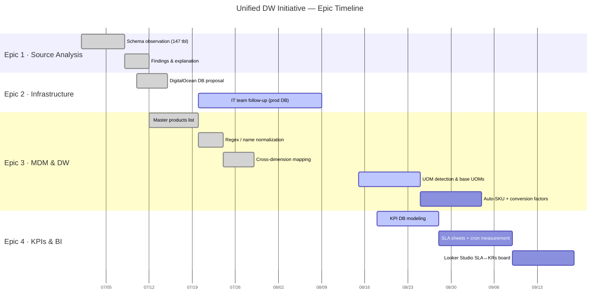

# 📊 Projects Overview & Status

!!! abstract "Source of Truth"
    This tracker formalizes the team **TO DO LIST** into a Work Breakdown Structure.
    Every task below maps to an Epic page, a technical document, and a completion status.

## 1. Portfolio Dashboard

| Track / Epic | Scope | Tasks | Done | Completion | Detail Page |
|---|---|:---:|:---:|:---:|---|
| 🌅 Daily Routine | Reporting & analytics cadence | 6 | 2 | ~50% | [Daily Routine](daily-routine.md) |
| 🗄️ Epic 1 | Source System Analysis (`das-db`) | 2 | 2 | **100%** | [Epic 1](epic-1-source-analysis.md) |
| 🔄 Epic 2 | Infrastructure & ETL Architecture | 2 | 1 | 50% | [Epic 2](epic-2-infrastructure-etl.md) |
| 🏗️ Epic 3 | MDM & Data Warehouse Build | 9 | 4 | 45% | [Epic 3](epic-3-mdm-dw.md) |
| 📊 Epic 4 | OKRs, KPIs & BI Delivery | 7 | 0 | 10% | [Epic 4](epic-4-performance-bi.md) |
| 🎫 Epic 5 | BI Ticket Resolution | 5 | 0 | 10% | [Epic 4](epic-4-performance-bi.md) |

### Status Legend

| Icon | Meaning |
|:---:|---|
| ✅ | Done — delivered & validated |
| 🚧 | Active — in progress |
| 📋 | Planned — not started |
| 🔁 | Recurring — daily/weekly cadence |

## 2. Roadmap

## 3. Cross-Mapping: WBS → Technical Documentation

| WBS Task | Technical Document |
|---|---|
| Master products list / mapping | [ETL Guide 4 — Pipeline A](../guides/etl-guide.md) |
| Sales fact build | [ETL Guide 5 — Pipeline B](../guides/etl-guide.md) |
| Daily refresh procedure | [ETL Runbook](../policies/etl-runbook.md) |
| Schema audit & findings | [Epic 1](epic-1-source-analysis.md) · [Schema Appendix](../appendix/database-schema.md) |
| Governance & change control | [Data Governance](../policies/data-governance.md) |
| Access & usage rules | [Data Usage Terms](../terms/data-usage.md) |