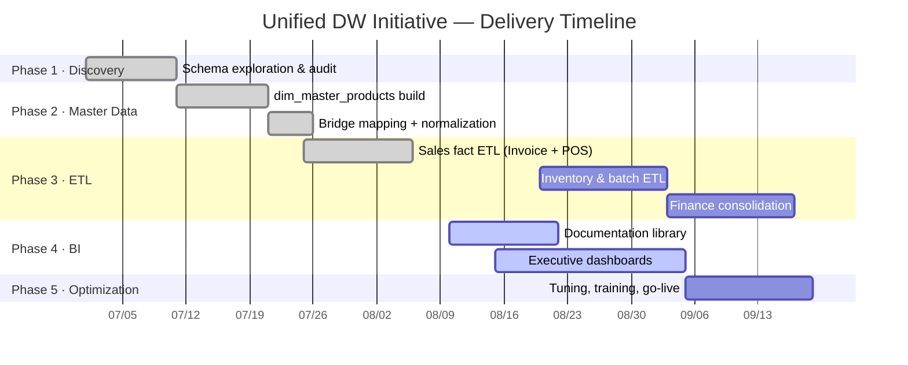

# 📊 Projects Overview & Status

!!! abstract "Initiative Goal"
    Unify the fragmented data systems of the Business Units (**M-Tech, M-Kitchen, Marathon Express, M-Trading, ShweZay**) into a single data warehouse — enabling cross-BU analytics, standardized master data, and executive-level BI.

---

## 1. Sub-Project Registry

Every sub-project maps to its technical documentation. Completion status is updated each sprint.

| # | Sub-Project | Phase | Status | Completion | Key Deliverables | Reference |
|---|---|---|---|---|---|---|
| 1 | Schema Discovery & Audit | 1 | ✅ Done | 100% | `das-db` schema docs, OLTP anti-pattern report | [ETL Guide §3](../guides/etl-guide.md) |
| 2 | Master Data Build | 2 | ✅ Done | 100% | `dim_master_products` (18,906 golden records), `bridge_product_mapping` | [ETL Guide §4](../guides/etl-guide.md) |
| 3 | Sales Fact ETL | 3 | ✅ Done | 100% | `fact_saless` (~203K rows), `map_product_master`, `agg_product_sales` | [ETL Guide §5](../guides/etl-guide.md) |
| 4 | Documentation Library | 4 | 🚧 Active | 80% | This MkDocs site + Cloudflare Access gate | [Home](../index.md) |
| 5 | Executive BI Dashboards | 4 | 🚧 Active | 30% | Group sales dashboard v1 (Power BI / Looker) | — |
| 6 | Inventory & Batch ETL | 3 | 📋 Planned | 0% | `fact_inventory_batch`, FEFO expiry alerts | — |
| 7 | Finance Consolidation | 3 | 📋 Planned | 0% | Cross-BU AP/AR exposure view | — |
| 8 | Optimization & Go-Live | 5 | 📋 Planned | 0% | Performance tuning, training, support | — |

### Status Legend

| Icon | Meaning |
|---|---|
| ✅ Done | Completed, validated, and in production |
| 🚧 Active | Currently in development |
| 📋 Planned | Scheduled, not started |
| ⏸️ On Hold | Paused pending decision |

---

## 2. Delivery Roadmap

---

## 3. Validated Metrics (Latest Full Load)

| Metric | Value | Target | Status |
|---|---|---|---|
| Master products (golden records) | 18,906 | — | ✅ |
| Sales fact rows (Invoice + POS) | ~203,713 | — | ✅ |
| Master match rate (post-bridge) | ≥ 99.4% | ≥ 95% | ✅ |
| Active Business Units in scope | 7 | 5 (Phase 1) | ✅ |
| Duplicate aggregate keys | 0 | 0 | ✅ |

!!! note "Figures refresh on every full ETL run — see the [ETL Runbook](../policies/etl-runbook.md) for the validation queries."

---

## 4. Current Sprint Board

- [x] Build `dim_master_products` golden record (barcode → sku priority)
- [x] Normalize product names (`UPPER`, `*→X`, strip spaces)
- [x] Unified `fact_saless` with dual product context (BU + master)
- [x] Cross-BU bridge (`map_product_master`) + backfill
- [ ] Deploy docs site with `@marathonmyanmar.com` email gate
- [ ] Connect Power BI to `agg_product_sales`
- [ ] Executive dashboard v1 (revenue, margin, cross-BU share)
- [ ] Inventory batch ETL design (`stock_summaries`, `stock_histories`)

---

## 5. Objective → Delivery Mapping

| Initiative Objective | Delivered By | Status |
|---|---|---|
| Unify product SKUs across BUs | `dim_master_products` + `map_product_master` | ✅ |
| Cross-BU analytics | `fact_saless.business_id` + `sold_across_bu_count` | ✅ |
| Standardized UOM conversions | `product_conversion_links` mapping (design) | ⏳ Phase 3 |
| Consolidated AP/AR | Finance consolidation project | 📋 |
| Batch traceability / FEFO | Inventory & batch ETL | 📋 |
| Executive BI dashboards | Dashboards project | 🚧 |