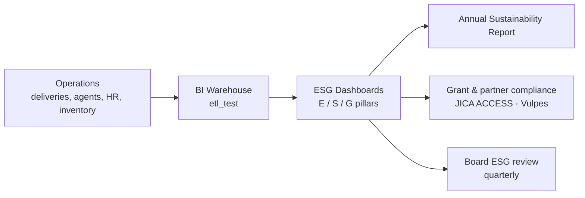

# 🌱 Sustainability & ESG — BI as the Measurement Engine

!!! quote "Source: [marathonmyanmar.com](https://marathonmyanmar.com/) · Sustainability Management"
    *80% of parcels in Yangon are delivered by bicycles with **zero CO₂ emission** ·
    36% women in full-time positions · 85% of our merchants are women ·
    50% of our agents are women · 70% of packaging bags are reusable ·
    30% of cities are 3-tier cities with underserved communities ·
    creating extra income of $50–$500/month for local SMEs in regional cities.*

These are not slogans — they are **measured facts**. This page documents how the
BI team turns each commitment into auditable data.

---

## 1. What Are ESG Metrics?

**ESG metrics** are specific data points used to evaluate a company's performance on
**Environmental, Social and Governance** issues. They turn non-financial information —
carbon emissions, labor policies, board diversity — into clear facts that investors,
partners (e.g., *Seed Myanmar Venture / Vulpes*, *JICA*) and regulators use to judge
long-term risk and behavior.

| Type | Definition | Marathon Example |
|---|---|---|
| **Quantitative** | Numerical, measurable facts | 80% bicycle deliveries; 36% women FT; 70% reusable bags |
| **Qualitative** | Descriptive reviews of policies & programs | Core-values code of conduct; board advisory charter; data-protection rules |

---

## 2. The Three Pillars — Commitments & BI Evidence

### 🌍 Environmental (E) — How we affect the natural world

| ESG Metric (pillar) | Marathon Commitment *(marathonmyanmar.com)* | Type | BI Source | Dashboard |
|---|---|---|---|---|
| **Carbon footprint** | 80% of Yangon parcels delivered by bicycle — **zero CO₂** | Quantitative | Delivery platform (Hero/Partner apps) → `fact_delivery_mode` | CO₂ & Green Logistics |
| **Resource management** | 70% of packaging bags are **reusable** | Quantitative | Packaging procurement & inventory SKUs (`stock_summaries`, `bills`) | Procurement ESG |

### 🤝 Social (S) — How we treat people & communities

| ESG Metric (pillar) | Marathon Commitment *(marathonmyanmar.com)* | Type | BI Source | Dashboard |
|---|---|---|---|---|
| **Diversity & inclusion** | 36% women in full-time positions | Quantitative | `das-db.employees` (`gender`, `employment_type`) | People & Inclusion |
| **Diversity & inclusion** | 85% women merchants · 50% women agents | Quantitative | Merchant/Agent platform registers | People & Inclusion |
| **Community impact** | 30% of cities are 3-tier (underserved) | Quantitative | `branches` ⋈ `townships`/`states` (city tier dim) | Network Reach |
| **Fair income** | $50–$500/month extra income for regional SMEs | Quantitative | `fact_agent_earnings` (settlement records) | Agent Economics |
| **Inclusion & culture** | 8 local languages · 7 ethnic groups · 3 religions in workforce | Quantitative | HR demographics register | People & Inclusion |

### 🏛️ Governance (G) — How we are managed & controlled

| ESG Metric (pillar) | Marathon Commitment *(marathonmyanmar.com — About/Leadership)* | Type | BI Source | Dashboard |
|---|---|---|---|---|
| **Board makeup** | Independent director + international board advisors; VC-backed (Vulpes) | Qualitative | Board register (reviewed quarterly) | Governance Review |
| **Business ethics** | Core values: *Respect · Be Positive · Be Accountable · Be Yourself · Be A Good Partner* | Qualitative | [Data Governance Policy](policies/data-governance.md) + code of conduct | Governance Review |
| **Data protection & audit** | Tech-enabled, end-to-end digitized processes; RBAC + immutable audit trails | Qualitative + Quantitative | `das-db.roles` / `role_modules`, `histories`, `api_call_logs`, `user_sessions` | Security & Audit |

---

## 3. ESG KPI Register (Warehouse)

All quantitative KPIs live in `agg_esg_monthly` and roll into the executive
SLA ↔ KRs board ([Epic 4](projects/epic-4-performance-bi.md)).

| KPI | Pillar | Grain | Refresh | Owner |
|---|:---:|---|---|---|
| `kpi_bicycle_delivery_pct` | E | city × month | monthly | Ops Lead |
| `kpi_reusable_packaging_pct` | E | warehouse × month | monthly | Procurement |
| `kpi_women_share_ft` | S | BU × quarter | monthly | HR Lead |
| `kpi_women_merchant_share` | S | network × month | monthly | Partnership Lead |
| `kpi_women_agent_share` | S | network × month | monthly | Partnership Lead |
| `kpi_tier3_city_share` | S | network × month | monthly | Expansion |
| `kpi_agent_extra_income` | S | city × month | monthly | Partners Relation |
| `kpi_board_independence` | G | company × year | quarterly | Company Secretary |
| `kpi_audit_log_coverage` | G | BU × month | monthly | Tech Solutions Lead |

### Sample measurement query — Social pillar (directly from `das-db`)

```sql
-- % women in full-time active positions, per Business Unit
SELECT
    b.name AS bu_name,
    COUNT(*) AS ft_headcount,
    ROUND(SUM(e.gender = 'Female') / COUNT(*) * 100, 1) AS women_ft_pct
FROM `das-db`.employees e
INNER JOIN `das-db`.businesses b ON e.business_id = b.id
WHERE e.employee_status  = 'Active'
  AND e.employment_type  = 'FullTime'
GROUP BY b.name
ORDER BY women_ft_pct DESC;
```

---

## 4. How BI Enables Sustainability



!!! tip "The BI contribution"
    Sustainability is a **data problem**. Our role is to ensure every published metric is
    **accurate, complete and defensible — beyond reasonable doubt** — so leadership,
    investors and grant auditors can trust the numbers Marathon reports.

---

## 5. Reporting Cadence

| Output | Cadence | Consumer |
|---|---|---|
| ESG dashboards (E/S/G) | Monthly refresh | BI & Ops leadership |
| Board ESG review pack | Quarterly | Board of Directors |
| Sustainability section of corporate site | Annual | Public, investors, partners |
| Grant compliance reports (e.g., JICA ACCESS) | Per agreement | Donor agencies |

---

> [What We Do](what-we-do.md) · [Who We Are](about.md) · [Data Governance](policies/data-governance.md) · [Project Board](projects/index.md)