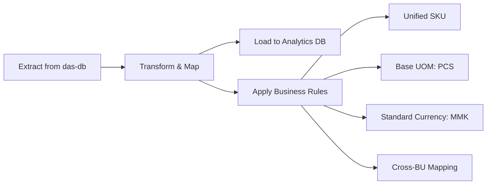

# 🥐 What We Do

We deliver the full analytics value chain — from raw ERP transactions to executive decisions.

## 1. The Analytics Maturity Ladder

## 2. Service Catalog

| # | Service | Cadence | Deliverable | Reference |
|---|---|---|---|---|
| 1 | Report & Briefing | 🔁 Daily | Management briefing from refreshed dashboards | [Daily Routine](projects/daily-routine.md) |
| 2 | KRs Monitoring Report | 🔁 Weekly | KR vs SLA synchronization board | [Epic 4](projects/epic-4-performance-bi.md) |
| 3 | Ad-hoc Analytics | On demand | Deep-dive analyses on `etl_test` | — |
| 4 | Master Report Catalog | Quarterly | Index of all standardized reports | [Daily Routine](projects/daily-routine.md) |
| 5 | Descriptive & diagnostic reporting | Continuous | Sales / stock / margin / cross-BU reports | — |
| 6 | Predictive & prescriptive reporting | Roadmap | Forecasts, reorder & FEFO alerts | — |
| 7 | Data Warehouse & ETL | 🔁 Daily | `dim_*` / `fact_*` / `agg_*` tables | [ETL Guide](guides/etl-guide.md) |
| 8 | Executive dashboards | Continuous | Looker Studio / Power BI boards | — |

## 3. How Data Flows

## 4. Operational vs Analytics — Why We Build the Warehouse

| Feature | Operational ERP | Analytics Warehouse |
|---|---|---|
| Unified SKUs | ❌ BU-specific | ✅ Master + BU mapping |
| Cross-BU AP/AR | ❌ Separate per BU | ✅ Consolidated view |
| Batch Tracking | ⚠️ Scattered | ✅ Centralized FEFO |
| Query Performance | ⚠️ Complex joins | ✅ Star-schema ready |
| BI Tool Friendly | ❌ Too complex | ✅ Clean dimensions |